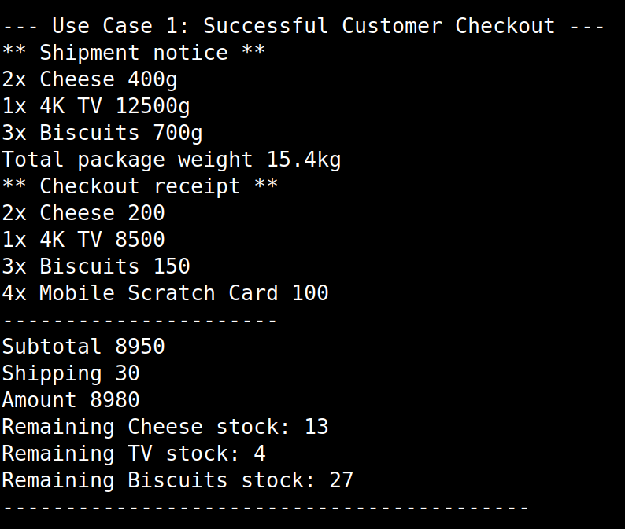
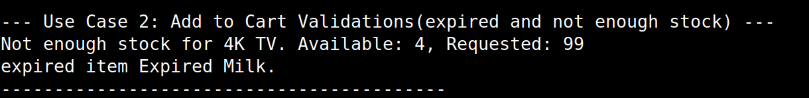
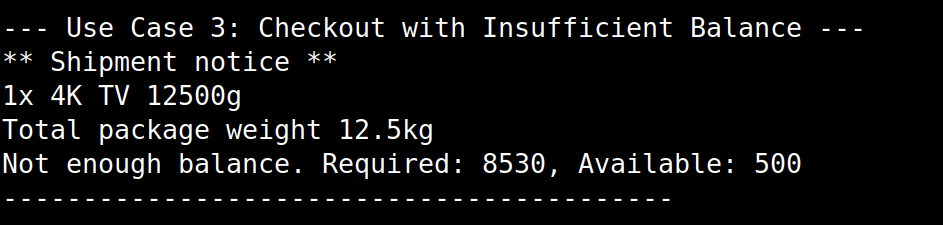
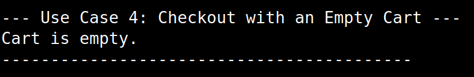

# Fawry E-Commerce System

A basic e-commerce system. This project showcases core Object-Oriented Programming (OOP) principles like inheritance and interfaces to manage a variety of product types like Product, Shippable, Expirable. The system handles customer carts, stock management, product expiration checks, shipping calculations, and checkout validation.

## Prerequisites

.NET 9.0 SDK or a later version.

## How to Run

You can run this project easily from your terminal using the .NET CLI.

### Clone the repo

```bash
git clone https://github.com/HossamSaberX/FawryECommerceSystem
cd FawryECommerceSystem
```

### Run the Project
This command will build and run the application.

```bash
dotnet run
```

## Expected Output

The application runs through four distinct use cases to demonstrate its functionality, from a successful purchase to various error-handling scenarios.

### 1. Successful Customer Checkout

A customer successfully adds multiple items to their cart and completes the checkout. The output displays the shipment notice, the final receipt, and the updated stock levels for the purchased items.

```csharp
// Use Case 1: Successful Purchase
var customer1 = new Customer(10000);
customer1.add(cheese, 2);
customer1.add(tv, 1);
customer1.add(biscuits, 3);
customer1.add(scratchCard, 4);
customer1.checkout();
```



### 2. Add-to-Cart Validations

The system demonstrates input validation by preventing a customer from adding an item with insufficient stock and an expired item to their cart.

```csharp
// Use Case 2: Validation Scenarios during Shopping
var customer2 = new Customer(500);
customer2.add(tv, 99);        // Insufficient stock
customer2.add(expiredMilk, 1); // Expired product
```



### 3. Insufficient Balance at Checkout

A customer attempts to check out but does not have enough balance to cover the cost of the items and shipping. The transaction is aborted with an error message.

```csharp
// Use Case 3: Checkout with Insufficient Balance
customer2.add(tv, 1);  // Customer with 500 balance trying to buy 8500 TV
customer2.checkout();
```



### 4. Empty Cart Checkout

The final test shows the system's response when a customer tries to check out with an empty cart.

```csharp
// Use Case 4: Checkout with an Empty Cart
var customer3 = new Customer(1000);
customer3.checkout();  // No items added to cart
```


